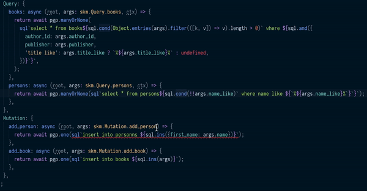

# ts-sql-plugin
TypeScript Language Service Plugin for SQL with a tagged template strings SQL builder. Inspired by [andywer/squid](https://github.com/andywer/squid)



# Usage

Install the plugin, run:

```sh
npm install ts-sql-plugin -D
```

Then, configure the `plugins` section in your *tsconfig.json*:

```json
{
  "compilerOptions": {
    "module": "commonjs",
    "target": "es5",
    "plugins": [
      {
        "name": "ts-sql-plugin",
        "command": "psql -U postgres -c", // optionnal
        "tags": { // optionnal
          "sql": "sql",
          "and": "and",
          "ins": "ins",
          "upd": "upd",
          "raw": "raw",
          "cond": "cond"
        }
      }
    ]
  }
}
```

**Note**: If you're using Visual Studio Code, you'll have to use the first approach above, with a
path to the module, or run the "TypeScript: Select TypeScript Version" command and choose "Use
Workspace Version", or click the version number between "TypeScript" and 😃 in the lower-right
corner. Otherwise, VS Code will not be able to find your plugin. See https://github.com/microsoft/TypeScript/wiki/Writing-a-Language-Service-Plugin#testing-locally

Then in your code:

```ts
import sql from 'ts-sql-plugin/lib/sql';

import db from './database';

db.query(sql`select * from wrong_table_name where wrong_column_name=${name}`);

// sql.and
db.query(sql`select * from person where ${sql.and({ wrong_column_name: value, name: name })}`);

// sql.ins
db.query(sql`insert into person ${sql.ins({ id: uuid(), name: name, ageeee: wrong_column_name_value })}`);

// sql.ins
db.query(sql`update person set ${sql.upd({ wrong_name_column: name, age: 23 })} where id=${id}`);

// operator
db.query(sql`select * from person where ${sql.and({ 'name like': '%'+name_like+'%', 'ageee >': age_bigger_than })}`);

// sql.cond
db.query(sql`select * from person where name=${name} ${sql.cond(!!age_bigger_than)` and ageeee > ${age_bigger_than}`}`);

```

**And there is a complete example using [ts-sql-plugin](https://github.com/xialvjun/ts-sql-plugin) and [skm_ts](https://github.com/xialvjun/skm_ts) in folder test_ts_sql_plugin.**
