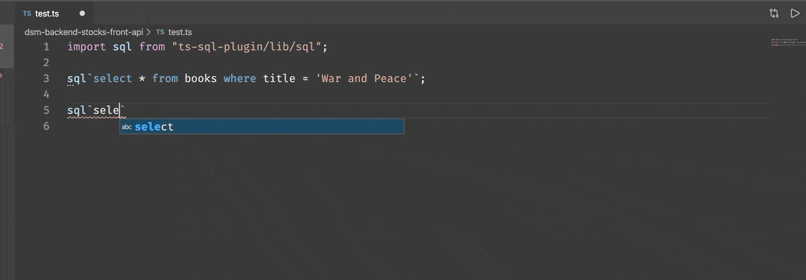

# ts-sql-plugin
TypeScript Language Service Plugin for SQL with a tagged template strings SQL builder. Inspired by [andywer/squid](https://github.com/andywer/squid)

#### check sql error demo:


#### autocomplete demo:


# Usage

## run as a language service plugin

Install the plugin, run:

```sh
npm install ts-sql-plugin -D
```

Then, configure the `plugins` section in your *tsconfig.json*:

```json
{
  "compilerOptions": {
    "module": "commonjs",
    "target": "es5",
    "plugins": [
      {
        "name": "ts-sql-plugin",
        "command": ["psql", "-c"], // optionnal
        "tags": { // optionnal
          "sql": "sql",
          "and": "and",
          "or": "or",
          "ins": "ins",
          "upd": "upd",
          "raw": "raw",
          "cond": "cond"
        },
        "cost_pattern": "/\\(cost=\\d+\\.?\\d*\\.\\.(\\d+\\.?\\d*)/",
        "error_cost": null, // 100,
        "warn_cost": null, // 50,
        "info_cost": null, // -1,
      }
    ]
  }
}
```

**Note**: If you're using Visual Studio Code, you'll have to use the first approach above, with a
path to the module, or run the "TypeScript: Select TypeScript Version" command and choose "Use
Workspace Version", or click the version number between "TypeScript" and 😃 in the lower-right
corner. Otherwise, VS Code will not be able to find your plugin. See https://github.com/microsoft/TypeScript/wiki/Writing-a-Language-Service-Plugin#testing-locally

## run as a command line application

Install the plugin, run:

```sh
npm install ts-sql-plugin -g
```

Then run:

```sh
ts-sql-plugin -p ./my_ts_project psql -U postgres -c
```

# Then in your code:

<span style="color:red;">In the code below, some of the table names or column names are intentionally wrong.</span> `ts-sql-plugin` will show you the errors.

```ts
import sql from 'ts-sql-plugin/lib/sql';

import db from './database';

db.query(sql`select * from wrong_table_name where wrong_column_name=${name}`);

// sql.and
db.query(sql`select * from person where ${sql.and({ wrong_column_name: value, name: name })}`);

// sql.or
db.query(sql`select * from person where ${sql.or([{ 'name like': 'abc%', age: 23 }, { 'age >': 23 }])}`);
db.query(sql`select * from person where (name like ${'abc%'} and age=${23}) or age > ${23}`);

// sql.ins
db.query(sql`insert into person ${sql.ins({ id: uuid(), name: name, ageeee: wrong_column_name_value })}`);
db.query(sql`insert into person ${sql.ins([{ id: uuid(), name, age: 23 }, {id, name:'ppp', age:30}])}`);

// sql.upd
db.query(sql`update person set ${sql.upd({ wrong_name_column: name, age: 23 })} where id=${id}`);

// like, >, < etc
db.query(sql`select * from person where ${sql.and({ 'name like': '%'+name_like+'%', 'ageee >': age_bigger_than })}`);

// sql.raw with ?: operator
db.query(sql`select * from person order by age ${reverse ? sql.raw`desc` : sql.raw`asc`}`);

// sql.cond
db.query(sql`select * from person where name=${name} ${sql.cond(!!age_bigger_than)` and ageeee > ${age_bigger_than}`}`);

// ! where in will produce error because of node-postgres doesn't support it. use where column=any()
db.query(sql`select * from person where id in (${[uuid(), uuid()]})`);
db.query(sql`select * from person where id = any(${[uuid(), uuid()]})`);

// you can use sql queries inside each other
const s1 = sql`select * from subscriptions.attribute where entity_id = any(${[7045]})`;
const s2 = sql`select * from (${s1}) attr where attribute_id = any(${[7049, 7050]})`;

// ignore cost for query stuff implemented
const s1 = sql`
  -- ts-sql-plugin:ignore-cost
  select * from subscriptions.attribute
`;

// you can emit sql to explicit file
// this will be emitted to emit-sql/allAttribute.sql file
// you may change `emit-sql` folder to another via `--emit-out-dir` option of cli
// also `--watch` option of cli can be used to emit it in realtime
const s1 = sql`
  -- ts-sql-plugin:emit("allAttribute")
  select * from subscriptions.attribute
`;
```

**And there is a complete example using [ts-sql-plugin](https://github.com/xialvjun/ts-sql-plugin) and [skm_ts](https://github.com/xialvjun/skm_ts) in folder test_ts_sql_plugin.**

## Generate types from emitted sql

You can use [types-from-sql](https://github.com/o175/types-from-sql) tool
for generating types from your emitted sql via `--ts-sql-plugin:emit("someName")` directive.
For generate types in realtime, use `--watch` option of cli.

## VSCode syntax highlight extension

https://marketplace.visualstudio.com/items?itemName=darky.vscode-ts-sql-plugin
